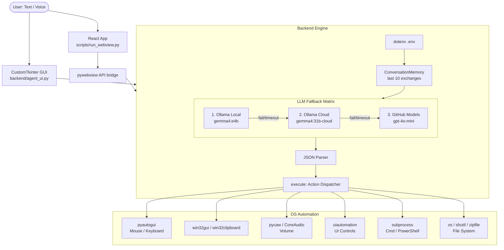

# R.A.G.E. — Windows Automation Agent v2.0

> **Rarely Appreciated Genius Entity** — a local, LLM-powered Windows automation agent with a dual-mode interface: a modern React/pywebview app and a CustomTkinter desktop GUI.

---

## ✨ What it does

Type (or speak) a natural language command — R.A.G.E. routes it through a multi-LLM fallback chain, parses the JSON action, and executes it directly on your Windows machine.

```
"open chrome at youtube.com"          → launches Chrome with YouTube
"set volume to 40"                    → sets system master volume
"take a screenshot and save to desktop" → captures + saves screenshot
"run powershell Get-Process"          → returns top running processes
"send WhatsApp to +91... with hello"  → opens WhatsApp and sends message
```

---

## 🗂️ Project Structure

```
windows_automation_agent/
├── backend/
│   ├── __init__.py          # makes backend a package
│   ├── windows_agent.py     # core engine: LLM routing, action dispatcher, memory
│   └── agent_ui.py          # CustomTkinter GUI (Arc Reactor UI)
├── frontend/                # React + Vite + TypeScript UI
│   ├── src/
│   │   └── components/
│   │       ├── MainApp.tsx  # main application component
│   │       └── GlobeCanvas.tsx
│   ├── dist/                # production build (gitignored, run `npm run build`)
│   └── package.json
├── scripts/
│   └── run_webview.py       # pywebview launcher — serves frontend/dist/ with Python API bridge
├── .env.example             # API key template
├── .gitignore
├── pyproject.toml
├── requirements.txt         # runtime deps
├── requirements-dev.txt     # dev/lint deps
└── README.md
```

---

## 🏛️ Architecture



---

## 🚀 Getting Started

### Prerequisites
- Windows 10/11
- Python 3.11+
- Node.js 18+ (for the React frontend)
- Git

### 1 — Clone & create venv

```powershell
git clone <repo-url>
cd windows_automation_agent

python -m venv venv
.\venv\Scripts\Activate.ps1
```

### 2 — Install Python dependencies

```powershell
pip install -r requirements.txt

# Optional dev tools (linting, formatting, tests)
pip install -r requirements-dev.txt
```

### 3 — Configure environment

```powershell
copy .env.example .env
```

Open `.env` and fill in your keys (Ollama Local needs no key):

```env
GITHUB_TOKEN=ghp_your_github_token_here
OLLAMA_API_KEY=your_ollama_cloud_key_here
WEATHER_API_KEY=your_openweathermap_key_here
```

### 4 — Build the frontend

```powershell
cd frontend
npm install
npm run build
cd ..
```

### 5 — Run

#### Webview UI (React — recommended)
```powershell
.\venv\Scripts\python.exe scripts\run_webview.py
```

#### CustomTkinter UI (Arc Reactor)
```powershell
.\venv\Scripts\python.exe -m backend.agent_ui
```

#### CLI / batch mode
```powershell
.\venv\Scripts\python.exe -m backend.windows_agent
```

---

## ⌨️ Keyboard Shortcuts (Webview UI)

| Shortcut | Action |
|---|---|
| `Enter` | Send command |
| `↑ / ↓` | Cycle through command history |
| `Ctrl+K` | Focus the command input from anywhere |

---

## 🎛️ LLM Provider Dropdown

The title bar contains a **LLM_PROVIDER** selector. Options:

| Selection | Behaviour |
|---|---|
| `Auto (Fallback)` | Tries Ollama Local → Ollama Cloud → GitHub in order |
| `Ollama (Local)` | Pins to local Ollama only (no fallback) |
| `Ollama (Cloud)` | Pins to Ollama Cloud proxy |
| `GitHub` | Pins to GitHub Models (gpt-4o-mini) |

---

## ⚡ Quick Actions (Chat Panel)

| Chip | Command sent |
|---|---|
| Screenshot | `take a screenshot and save it to my desktop` |
| Sys Info | `get system info cpu ram and disk` |
| Clipboard | `get clipboard contents` |
| Google | `open https://www.google.com` |
| Explorer | `open explorer` |
| Notepad | `open notepad` |
| Volume 70% | `set volume to 70` |
| Task Mgr | `open task manager` |

---

## 🔧 Supported Actions

| Category | Actions |
|---|---|
| **Apps** | `open_app`, `close_app`, `open_url`, `switch_window`, `maximize_window`, `minimize_window`, `get_active_window` |
| **Keyboard / Mouse** | `type_text`, `press_keys`, `click_element`, `click_at`, `right_click`, `double_click`, `move_mouse`, `scroll`, `drag`, `paste_text` |
| **File System** | `create_file`, `read_file`, `delete_file`, `copy_file`, `move_file`, `rename_file`, `create_folder`, `delete_folder`, `list_files`, `zip_files`, `download_file` |
| **System** | `run_command`, `run_powershell`, `get_system_info`, `set_volume`, `get_clipboard`, `set_clipboard` |
| **Integrations** | `search_web`, `send_whatsapp`, `get_weather`, `set_reminder`, `say` |

---

## 📱 Recognised Applications

`notepad` · `calculator` · `explorer` · `mspaint` · `cmd` · `powershell` · `taskmgr` · `regedit` · `chrome` · `firefox` · `edge` · `brave` · `vscode` · `spotify` · `discord` · `zoom` · `teams` · `slack` · `telegram`

> Apps not in this list are opened automatically via Windows Search simulation.

---

## 📦 Dependencies

| File | Purpose |
|---|---|
| `requirements.txt` | Runtime — all libs needed to run the agent |
| `requirements-dev.txt` | Dev tools — `pytest`, `black`, `ruff`, `flake8` |

`pywebview` is required only for the Webview UI. `customtkinter` is required only for the Arc Reactor UI. Both are in `requirements.txt`.

---

## 💬 Example Commands

```
open chrome at youtube.com
take a screenshot and save it to my desktop
get system info
create a file at C:/test.txt with content Hello World
list files in C:/Users/Documents
download file from https://example.com/file.zip to C:/downloads/file.zip
run command ipconfig /all
run powershell Get-Process | Sort-Object CPU -Desc | Select -First 10
set volume to 50
get weather for Mumbai
set a reminder to drink water in 5 minutes
send WhatsApp to +91XXXXXXXXXX with message hello
search Google for latest Python news
zip C:/reports/a.pdf and C:/reports/b.pdf into C:/archive.zip
```

---

## 📄 License

MIT
