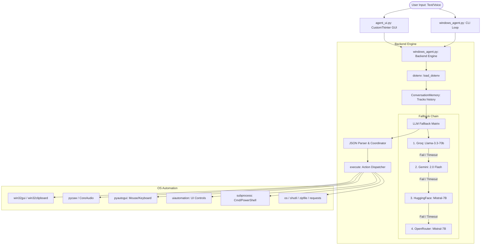

# 🤖 Windows Automation Agent (J.A.R.V.I.S.)

A robust, local Windows automation agent with a futuristic GUI frontend and a powerful backend action engine. The system is designed to translate natural language instructions (voice or text) into precise OS-level automation steps via a multi-LLM fallback chain.

---

## 📐 System Architecture

The project is structured into a clean **Model-View-Controller** style separation:



### 1. The Frontend UI (`agent_ui.py`)
* **Framework**: Built using `customtkinter` and `tkinter` to provide a premium, modern dark-themed application.
* **UX Elements**: Includes an animated spinning "Arc Reactor" canvas, real-time connection status badges, quick-action buttons for common workflows, and a scrollable chat log that renders messages inside conversation bubbles with timestamps.
* **Control Loop**: When you submit a command, the UI launches a background thread to call `ask_llm()` on the backend, updates the Arc Reactor state to processing, and renders the action details and results directly into the conversation log.

### 2. The Backend Engine (`windows_agent.py`)
* **Configuration**: Automatically loads variables from `.env` via `python-dotenv` and initializes keys for Groq, Gemini, Hugging Face, OpenRouter, and OpenWeatherMap.
* **Conversation History**: The `ConversationMemory` class retains the last 10 exchanges (User inputs and Agent actions) to inject contextual memory into LLM prompts.
* **Prompt Engineering**: The `build_prompt()` function enforces strict rules, instructing the LLM to output **only** a single valid JSON object representing the action to execute.
* **Provider Fallback Matrix**: To guarantee high availability, `ask_llm()` queries providers sequentially. If one fails, times out, or returns invalid JSON, it automatically falls back to the next provider:
  1. **Groq** (`llama-3.3-70b-versatile`)
  2. **Gemini** (`gemini-2.0-flash`)
  3. **HuggingFace** (`Mistral-7B-Instruct-v0.3`)
  4. **OpenRouter** (`mistralai/mistral-7b-instruct:free`)

---

## 🔧 Action Dispatcher & Tool Details

Every instruction parsed by the LLM is mapped to a specific action dictionary. The `execute(action)` dispatcher processes these actions. Below is a detailed breakdown of how each tool works under the hood:

### 📱 Application & Window Control
* **`open_app`**: Resolves paths from the `APP_PATHS` config. If the app name is a known executable or absolute path, it runs `subprocess.Popen()`. If it is a generic name (e.g., "Notepad" or a custom app name not ending in `.exe`), it uses `pyautogui` to simulate opening Windows Search (pressing `win`), typing the application name, and pressing `enter`. If a `url` parameter is provided, it passes the URL as an argument to the application.
* **`close_app`**: Extracts the process name from `APP_PATHS` or defaults to the input string, and executes a force-kill command using `taskkill /f /im <process_name> 2>nul` via `os.system()`.
* **`open_url`**: Normalizes the input URL scheme (ensuring it starts with `http`) and opens it in the system's default browser by running `start "" "<url>"` inside a subprocess shell.
* **`switch_window` / `maximize_window` / `minimize_window` / `focus_window`**: Utilizes `pygetwindow` (`gw.getWindowsWithTitle(substring)`) to locate matching windows by title. If found, it calls the corresponding native method (`.activate()`, `.maximize()`, `.minimize()`) on the window object.
* **`get_active_window`**: Interfaces directly with the Windows API via `win32gui` to retrieve the window handle (`GetForegroundWindow()`) and resolve its title text (`GetWindowText()`).

### ⌨️ Keyboard & Mouse Automation
* **`type_text`**: For short strings, writes characters sequentially using `pyautogui.write()`. For long strings (>50 characters) or multiline strings, copy-pastes the content instantly using `pyperclip.copy()` followed by simulating `ctrl+v` using `pyautogui.hotkey()`, preventing slow keystroke simulations and potential typos.
* **`press_keys`**: Parses hotkey strings (e.g., `ctrl+alt+delete`, `win+d`), splits them by the `+` character, and passes them to `pyautogui.hotkey()` to simulate simultaneous key presses.
* **`click_element`**: Leverages Microsoft UIAutomation via the `uiautomation` library. It searches for elements up to a depth of 5 with a matching `Name` property. If an exact match isn't found, it falls back to a case-insensitive substring search across the children of the Root Control. Once found, it invokes the `.Click()` method.
* **`click_at` / `right_click` / `double_click` / `move_mouse`**: Performs coordinates-based mouse operations using `pyautogui` mouse handlers. Coordinate inputs are automatically validated and clamped to safe screen bounds (between `5px` and display resolution bounds) to avoid raising off-screen exceptions.
* **`scroll`**: Triggers vertical scrolling using `pyautogui.scroll()`. An `up` direction uses a positive integer, while `down` uses a negative integer.
* **`drag`**: Moves the mouse cursor to a starting coordinate using `pyautogui.moveTo()` and simulates dragging to the destination coordinate offset via `pyautogui.drag()`.
* **`paste_text`**: Simulates the standard `ctrl+v` paste shortcut using `pyautogui.hotkey()`.

### 💾 File System Operations
* **`create_file`**: Expands environment variables and user home directories in the path, creates parent directories if missing using `os.makedirs()`, and writes the text content with `utf-8` encoding.
* **`read_file`**: Reads the target file contents (up to a 4 KB cap to prevent overloading context windows) using `utf-8` encoding with character replacement fallback for binary files.
* **`delete_file`**: Checks if the file path exists and removes it from disk using `os.remove()`.
* **`copy_file` / `move_file`**: Manages file movement and copy operations using the Python standard library's `shutil.copy2()` and `shutil.move()`.
* **`rename_file`**: Evaluates the file location, computes the destination path, and renames the file using `os.rename()`.
* **`create_folder`**: Generates a directory tree and any necessary parent directories using `os.makedirs(..., exist_ok=True)`.
* **`delete_folder`**: Recursively removes directory trees and all their files using `shutil.rmtree()`.
* **`list_files`**: Iterates through directories using `os.listdir()`, filters the first 50 entries, prefixes them with `[DIR]` or `[FILE]`, and returns a sorted listing.
* **`zip_files`**: Compiles files into a compressed ZIP archive using `zipfile.ZipFile` with deflate compression (`zipfile.ZIP_DEFLATED`).
* **`download_file`**: Fetches remote assets from a URL via a streaming request (`requests.get(..., stream=True)`), writing chunks of `64 KB` sequentially to disk.

### ⚙️ System Commands & Utilities
* **`run_command`**: Runs command shell instructions using `subprocess.run(shell=True)` and captures both stdout and stderr, truncating the returned output to `2 KB`.
* **`run_powershell`**: Spawns a PowerShell process with `-NoProfile` and `-Command` switches to run scripts cleanly without loading local user profiles, capturing console outputs.
* **`get_system_info`**: Uses the `psutil` library to collect CPU percentage, RAM consumption, and Disk utilization. If `psutil` is missing, it runs the native Windows `systeminfo` utility inside a shell fallback.
* **`set_volume`**: Connects to the Windows CoreAudio API via `pycaw` (Python Core Audio Windows) and `comtypes` to adjust master volume levels (scaling input `0-100` to `0.0-1.0` and updating the endpoint volume controller).
* **`get_clipboard` / `set_clipboard`**: Interacts with the clipboard via `win32clipboard` (opening, clearing, writing/reading text, and closing the clipboard). If this raises an error, it falls back to PowerShell clipboard commands (`Get-Clipboard` or `Set-Clipboard`).

### 🌐 Integrations
* **`search_web`**: Formats search queries into safe URL parameters and opens them in Google Chrome. If Chrome is not found, it uses the system shell fallback (`start "" "<url>"`).
* **`send_whatsapp`**: If given a telephone number, formats a direct URL (`whatsapp://send?phone=<phone>&text=<message>`) and opens it, then simulates pressing `enter` to send. If a contact name is given, it opens WhatsApp, opens the search bar (`ctrl+f`), types the contact name, selects the first match, and types/sends the message.
* **`get_weather`**: Queries the OpenWeatherMap API if a key is present. If no key is set, it falls back to scraping `wttr.in/<city>?format=3` via a simple HTTP GET request.
* **`set_reminder`**: Launches a daemonized background `threading.Thread` that sleeps for the specified time, then triggers the local Text-to-Speech system (`speak()`) to read the reminder aloud.
* **`say` / `speak`**: Accesses the system speech synthesizer via `pyttsx3` with properties set to a standard reading speed (175 WPM) to speak text outputs.

---

## 📦 Dependency Structure (Why two requirements files)

To facilitate team collaboration and clean dependency management, the project separates requirements:

1. **`requirements.txt` (Runtime / Production)**
   * Contains the core libraries required to execute the agent, handle automation, listen to audio, and run the GUI interface.
   * *Examples*: `pyautogui`, `customtkinter`, `python-dotenv`, `requests`, `pywin32`, `pycaw`, etc.
   * Keeps deployment environments slim and lightweight.

2. **`requirements-dev.txt` (Development / Quality Assurance)**
   * Contains packages used by developers for linting, code formatting, and running tests.
   * *Examples*: `pytest` (unit tests), `black` (formatting), `ruff` (fast linting), `flake8`.
   * Standardizes the developer environment without bloating production setups.

---

## 🚀 Getting Started (Developer Setup Guide)

Follow these steps to clean the directory, configure your environment variables, and get the agent running.

### Prerequisites
* Windows OS
* Python 3.11 or higher
* Git

### Step 1: Create a Virtual Environment
Create and activate a isolated Python virtual environment:
```powershell
# In PowerShell
python -m venv venv
.\venv\Scripts\Activate.ps1
```
```cmd
:: In Command Prompt
python -m venv venv
.\venv\Scripts\activate.bat
```

### Step 2: Install Dependencies
Upgrade pip and install the package dependencies based on your needs:
```powershell
# Install runtime dependencies (required)
pip install -r requirements.txt

# Install development tools (optional, for editing/testing)
pip install -r requirements-dev.txt

# Optional: Install the project in editable mode
pip install -e .
```

### Step 3: Configure Environment Variables
The application is fully environment-variable based to prevent credential leaks.
1. Copy the template `.env.example` file to create a local `.env` file (this file is ignored by Git):
   ```powershell
   copy .env.example .env
   ```
2. Open `.env` and fill in your API keys:
   ```env
   GROQ_API_KEY=gsk_your_groq_key_here
   GEMINI_API_KEY=AQ_your_gemini_key_here
   HF_API_KEY=hf_your_hf_key_here
   OPENROUTER_API_KEY=sk_your_openrouter_key_here
   WEATHER_API_KEY=your_openweathermap_key_here
   ```

### Step 4: Run the Application
You can run the interactive CustomTkinter GUI:
```powershell
python agent_ui.py
```
Or run the CLI version:
```powershell
python windows_agent.py
```

### Step 5: Verify Setup
You can run tests or formatting checks:
```powershell
# Format code
black .

# Lint code
ruff check .

# Run test batch (CLI mode test)
python windows_agent.py
# Choose 'b' (batch) and press enter to verify parser with test_prompts.txt
```
