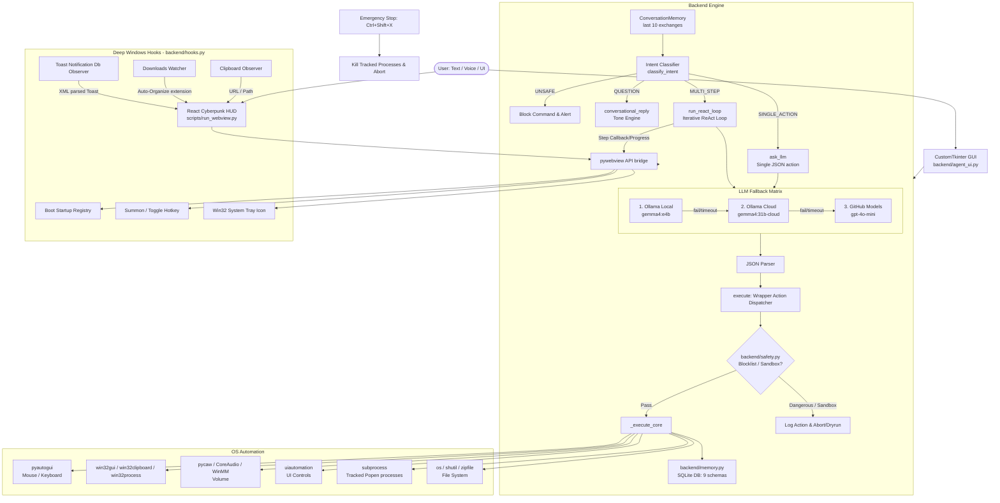

# R.A.G.E. — Windows Automation Agent v2.2

> **Rarely Appreciated Genius Entity** — a local, LLM-powered Windows automation agent featuring a dual-mode interface: a cyberpunk React/pywebview HUD and a CustomTkinter desktop GUI.

---

## ✨ What it does

Type (or speak) a natural language command — R.A.G.E. classifies your intent, runs single or multi-step execution flows (via an adaptive ReAct reasoning loop), performs safety checks, and automates your Windows machine directly.

```
"open chrome at youtube.com"              → launches Chrome with YouTube
"tile Chrome and Notepad in a grid"       → tiles application windows
"find pdfs modified in the last 3 days"   → smart file search & actions
"start a 25 minutes pomodoro session"     → triggers a focus timer with UI metrics
"check battery and list resource hogs"    → queries system status & CPU/RAM hogs
"compile my daily morning briefing"       → aggregates weather, mail, calendar & notifications
"undo the last action"                    → reverses the last ledger execution
```

---

## 🗂️ Project Structure

```
windows_automation_agent/
├── backend/
│   ├── __init__.py          # makes backend a package
│   ├── windows_agent.py     # core engine: LLM routing, action dispatcher
│   ├── memory.py            # SQLite persistent memory, interaction history, macros [NEW]
│   ├── safety.py            # blocklist validator, sandbox, emergency stop hotkey [NEW]
│   ├── hooks.py             # startup registry, summon hotkey, system tray, observers [NEW]
│   └── agent_ui.py          # CustomTkinter GUI (Arc Reactor UI)
├── frontend/                # React + Vite + TypeScript UI
│   ├── src/
│   │   └── components/
│   │       ├── MainApp.tsx  # main application component
│   │       └── GlobeCanvas.tsx
│   ├── dist/                # production build (gitignored, run `npm run build`)
│   └── package.json
├── scripts/
│   └── run_webview.py       # pywebview launcher — serves frontend/dist/ with Python API bridge
├── tests/
│   └── test_safety_and_memory.py # safety, sandbox, and SQLite memory unit tests [NEW]
├── .env.example             # API key template
├── .gitignore
├── pyproject.toml
├── requirements.txt         # runtime deps
├── requirements-dev.txt     # dev/lint deps
└── README.md
```

---

## 🏛️ Architecture



### Key Execution Highlights

* **Intent Classifier & Routing**: R.A.G.E. first runs incoming commands through an intent classifier to check for safety limits (`UNSAFE`), conversational queries (`QUESTION`), multi-step goals (`MULTI_STEP`), or direct commands (`SINGLE_ACTION`).
* **Iterative ReAct Loops**: Multi-step workflows launch a Reason+Act loop (up to 10 steps) that coordinates operations, parses results, adapts to OS feedback, and streams live progress logs and tactical state metrics to the frontend.
* **Deep Windows Integration Hooks**: Includes system-wide summon hotkey (Ctrl+Shift+Space), system tray execution, clipboard updates watcher, automatic download files sorting, and live decoding of Windows Notification Database (`wpndatabase.db`) XML payloads.
* **Hardware Drivers & Fallbacks**: Integrated volume management with three fallback paths (`pycaw` -> `WinMM` via PowerShell -> virtual media keys), screen brightness control, bluetooth PnP toggling, and scheduled/deferred system power states (shutdown, restart, sleep, hibernate).
* **Headless Browser & Crypt Vault**: Playwright + BeautifulSoup automated web page scraping and form filling, backed by a machine-key encrypted local credentials database.

---

## 🚀 Getting Started

### Prerequisites
- Windows 10/11
- Python 3.11+
- Node.js 18+ (for the React frontend)
- Git

### 1 — Clone & create venv

```powershell
git clone <repo-url>
cd windows_automation_agent

python -m venv venv
.\venv\Scripts\Activate.ps1
```

### 2 — Install Python dependencies

```powershell
pip install -r requirements.txt

# Optional dev tools (linting, formatting, tests)
pip install -r requirements-dev.txt
```

### 3 — Configure environment

```powershell
copy .env.example .env
```

Open `.env` and fill in your keys (Ollama Local needs no key):

```env
GITHUB_TOKEN=ghp_your_github_token_here
OLLAMA_API_KEY=your_ollama_cloud_key_here
WEATHER_API_KEY=your_openweathermap_key_here
```

### 4 — Build the frontend

```powershell
cd frontend
npm install
npm run build
cd ..
```

### 5 — Run

#### Webview UI (React — recommended)
```powershell
.\venv\Scripts\python.exe scripts\run_webview.py
```

#### CustomTkinter UI (Arc Reactor)
```powershell
.\venv\Scripts\python.exe -m backend.agent_ui
```

#### CLI / batch mode
```powershell
.\venv\Scripts\python.exe -m backend.windows_agent
```

---

## ⌨️ Keyboard Shortcuts (Webview & System)

| Shortcut | Scope | Action |
|---|---|---|
| `Enter` | Webview | Send command |
| `↑ / ↓` | Webview | Cycle through command history |
| `Ctrl+K` | Webview | Focus the command input from anywhere |
| `Ctrl+Shift+Space` | Global System | **Summon / Minimize** R.A.G.E. window toggler |
| `Ctrl+Shift+X` | Global System | **Emergency Stop** (instantly aborts executions & kills active subprocesses) |

---

## 🎛️ LLM Provider Dropdown

The title bar contains a **LLM_PROVIDER** selector. Options:

| Selection | Behaviour |
|---|---|
| `Auto (Fallback)` | Tries Ollama Local → Ollama Cloud → GitHub in order |
| `Ollama (Local)` | Pins to local Ollama only (no fallback) |
| `Ollama (Cloud)` | Pins to Ollama Cloud proxy |
| `GitHub` | Pins to GitHub Models (gpt-4o-mini) |

---

## ⚡ Quick Actions (Chat Panel)

| Chip | Command sent |
|---|---|
| Screenshot | `take a screenshot and save it to my desktop` |
| Sys Info | `get system info cpu ram and disk` |
| Clipboard | `get clipboard contents` |
| Google | `open https://www.google.com` |
| Explorer | `open explorer` |
| Notepad | `open notepad` |
| Volume 70% | `set volume to 70` |
| Task Mgr | `open task manager` |

---

## 🧠 Memory, Safety & Windows Hooks (v2.2)

### 1. Advanced Memory Layer
* **Interaction History & Ledger**: Tracks frequencies of command patterns and logs every step, action type, parameters, and results to a structured `execution_ledger` SQLite table.
* **Transaction Reversal (Undo/Replay)**: Allows reversing actions (`undo_last_action` utilizing dynamic inverse handlers like deleting a created file or un-focusing an app) or re-executing/replaying entries directly from the ledger.
* **Persistent Fact-Memory Database**: Key-free local SQLite database (`local_memories`) that extracts personal facts and settings from chat flows to dynamically personalize LLM replies.
* **Macro Recommendations & Sessions**: Grouping sequential commands into temporal sessions to automatically recommend macros when repetitive patterns are detected within customizable settings (default 180s interval, three repeats).

### 2. Safety & Permission Layer
* **Pattern Blocklist**: Blocks high-risk commands matching dangerous expressions (e.g. System32 deletion, recursive root deletes, disk formatting, registry edits).
* **Confirmations**: Displays safety validation dialog modals in the React UI for destructive operations (like folder/file deletions) before execution.
* **Sandbox Mode**: Sandbox toggles dry-runs via Settings. When active, commands parse normally but side-effects are disabled, logging a `[SANDBOX DRY-RUN]` description.
* **Action Logs**: Appends commands, action payloads, and outcomes to daily logs at `~/.jarvis/logs/YYYY-MM-DD.log`.

### 3. System Integration Hooks
* **Summon Hotkey (Ctrl+Shift+Space)**: System-wide summon/toggle toggles the window focus of the React panel.
* **Emergency Stop Hotkey (Ctrl+Shift+X)**: Instantly aborts executing ReAct loops, alerts the UI, and kills all active subprocesses.
* **System Tray**: Live win32 system tray icon agent.
* **Clipboard History Daemon**: Clipboard observer that saves text copies in a database (accessible via the Clipboard history tab with click-to-copy).
* **File Watcher**: Auto-organizes files downloaded to `~/Downloads` (by file extension categories) and triggers UI alert toasts.
* **Toast Notification DB Watcher**: Queries the Windows Notification DB (`wpndatabase.db`), decodes XML payloads, and streams incoming OS toasts to the UI HUD panel.

---

## 🔧 Supported Actions

| Category | Actions |
|---|---|
| **Apps & Windows** | `open_app`, `close_app`, `open_url`, `switch_window`, `maximize_window`, `minimize_window`, `get_active_window`, `focus_window`, `tile_windows`, `position_window`, `manage_tabs` |
| **Keyboard / Mouse** | `type_text`, `press_keys`, `click_element`, `click_at`, `right_click`, `double_click`, `scroll`, `move_mouse`, `drag`, `paste_text`, `screenshot` |
| **File System & Trash** | `create_file`, `read_file`, `delete_file`, `copy_file`, `move_file`, `rename_file`, `create_folder`, `delete_folder`, `list_files`, `zip_files`, `unzip_files`, `download_file`, `smart_file_search`, `empty_recycle_bin` |
| **Developer Tools** | `run_code_snippet` (Python/JS/PS1/BAT sandbox execution), `read_file_tail`, `git_command`, `docker_command`, `http_request` |
| **Browser Scrapers** | `scrape_web_page`, `download_page_images`, `fill_web_form`, `search_browser_history` |
| **Credentials Vault** | `store_credential`, `get_credential`, `delete_credential` (machine-key encrypted database) |
| **Office & Comms** | `send_email`, `draft_email`, `fetch_emails` (Outlook bridge), `create_calendar_event`, `list_calendar_events`, `delete_calendar_event`, `get_active_notifications`, `compile_daily_briefing` |
| **System & Hardware** | `run_command`, `run_powershell`, `get_system_info`, `get_battery_status`, `get_resource_hogs`, `connect_wifi`, `turn_off_wifi`, `manage_bluetooth`, `set_brightness`, `startup_manager`, `power_command` (shutdown/restart/sleep/hibernate), `set_volume`, `get_clipboard`, `set_clipboard` |
| **Utilities & Focus** | `start_pomodoro`, `stop_pomodoro` (async countdown), `list_clipboard_history` (SQLite daemon), `take_note` (Markdown parser), `add_todo`, `list_todos`, `mark_todo_complete`, `delete_todo` (SQLite todo list) |
| **Chat & Tone Engine** | `search_web`, `send_whatsapp`, `get_weather`, `set_reminder`, `say`, `reply` (tone-engine conversational chatbot) |
| **Macros & Session** | `create_macro`, `edit_macro`, `list_macros`, `undo_last_action`, `repeat_last_action` (SQLite execution ledger undo/replay) |

---

## 📱 Recognised Applications

`notepad` · `calculator` · `explorer` · `mspaint` · `cmd` · `powershell` · `taskmgr` · `regedit` · `chrome` · `firefox` · `edge` · `brave` · `vscode` · `spotify` · `discord` · `zoom` · `teams` · `slack` · `telegram`

> Apps not in this list are opened automatically via Windows Search simulation.

---

## 📦 Dependencies

| File | Purpose |
|---|---|
| `requirements.txt` | Runtime — all libs needed to run the agent |
| `requirements-dev.txt` | Dev tools — `pytest`, `black`, `ruff`, `flake8` |

`pywebview` is required only for the Webview UI. `customtkinter` is required only for the Arc Reactor UI. Both are in `requirements.txt`.

---

## 💬 Example Commands

```
open chrome at youtube.com
tile Chrome and Notepad in a grid layout
find all pdfs modified in the last 7 days under C:/Users/Documents
compress C:/projects/source into C:/projects/backup.zip
start a 25 minutes pomodoro focus session
set screen brightness to 60%
connect to WiFi profile HomeNetwork
check battery levels and list resource hogs
take a note that meeting is postponed under category Work
add todo review code architecture
compile my morning daily briefing
undo my last action
run powershell Get-Service | Where-Object {$_.Status -eq "Running"}
store credential for github.com with user testuser and password secret
fetch my last 5 emails and show active notifications
```

---

## 📄 License

MIT
